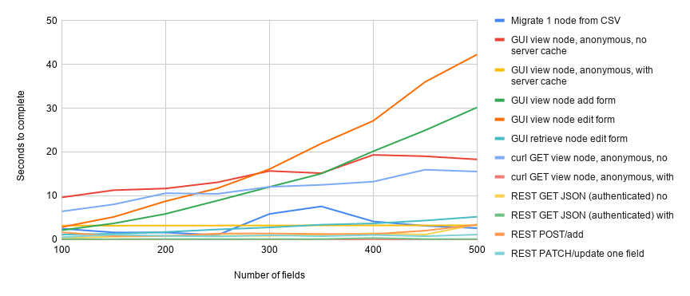
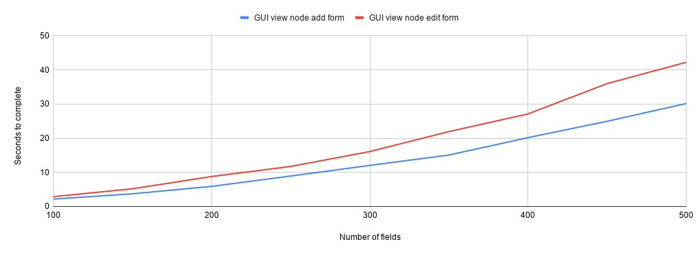
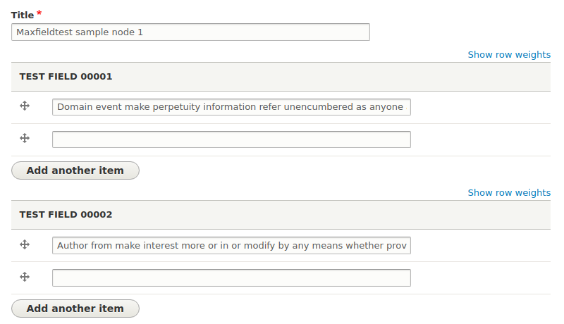

## Goal

By performing the tests described below, I hoped to observe relationsips between the number of fields on a Drupal content type and the time-to-completion of a set of tasks (such as rendering node conent, add/edit forms, REST requests, etc.) on nodes of that content type. My motiviation for doing this was to 1) to document practical limits on the number of fields on a content type, and 2) to provide data that would generate additional areas of investigation leading to workarounds or strategies for managing Islandora content types that have large numbers of metadata fields.

## Test results

### Environment

All tests were done on an Islandora Playbook virutal machine, using its master branch at commit 47e829a2b222ebcb5c3f6e537c79d107912b40f9 (March 29, 2020, a couple of weekd prior to the release of Islandora 8 1.1.0). This VM used 1 CPU and 4GB of RAM, with MySQL as the backend RDBMS and Ubuntu 16.04, the default settings for VMs created using Islandora Playbook. Host was Thinkpad running Ubuntu 18.04 on a i5-8350U CPU @ 1.70GHz × 8 with 16GB of RAM.

### Methodology

The tasks that I timed were:

* Migrate 1 node from CSV
* Viewing (using the Chrome browser) this node as anonymous, with an empty Drupal cache
* Viewing (using the Chrome browser) this node as anonymous with a populated Drupal cache
   * Fetcing this same content using `curl` with both empty and populated Drupal cache
* Viewing (using the Chrome browser) the node add form for my content type, as the "admin" user
* Viewing (using the Chrome browser) the node edit form for my content type (populated with node content), as the "admin" user
   * Fetching this same content using `curl`
* Using `curl` to issue a `GET` request to the sample node's JSON endpoint with an empty Drupal cache, authenticated as the "admin" user
* Using `curl` to issue a `GET` request to the sample node's JSON endpoint with a populated Drupal cache, authenticated as the "admin" user
* Using `curl` to issue a `POST` request to create a node
* Using `curl` to issue a `PATCH` request to update a single field on a node

To time the tasks performed using Chrome, I used Chrome's "Performance" tool, available in the hamburger menu > More tools > Developer tools. To time the tasks performed using Chrome, I used the "Total" time produced in the performance tool's "summary" output. To time the tasks performed using curl, I ran the requests with the Linux `time` command, e.g., `time curl http://localhost:8000/node/50` and used the 'real' value from this ouput.

I chose to migrate only a single node because I wanted to reduce variables that may affect performance to as few as possible. I also speculated that retrieving the same content, using the same caching, in both a graphical web browser and curl would allow me to establish a baseline time that Drupal takes to assemble and deliver HTML markup and content, in order to expose the time it takes to render JavaScript and CSS.

## Results

### Overall:

### Node add and edit forms

Biggest impact of increasing number of fields on a content type is the time it takes for the node add end edit forms to finish rendering:

User experience diminshes as the number of fields increases.

The most likely cause of these long rendering times is the JavaScript used by the node add and edit forms. Chrome's performance tool helpfully breaks down the time to render a page into loading, scripting, rendering, painting, system, and idle slices. By far, the largest slice of activity when viewing the node add and edit forms is scripting, followed by rendering. Here is a representative example visualization provided by the tool:

During very long rendering of forms, I observed that the drag and drop UI provided by Drupal to order multiple field values:

did not render but instead showed the native HTML "row widget" weight assignment elements:

Based on this behavior, it seems likel that this JavaScript is contributing heavily to the very long scripting and rendering times shown in the pie chart above.

### Viewing node content

Since Drupal's page caching for anonymous users is very effective, so it isn't surprising that the number of fields on a node did not increase the amount of time required to render or download the cached node content and markup. The time requiered to retrieve uncached node content and markup did increase with the number of fields on a node, using both Chrome and curl, but the increase was greater in Chrome:

Retrieving the JSON representation of a node followed a similar pattern, althought I only tested for authenticated requests here, not anonymous, under the assumption that in practice most REST operations would be authenticated:

Overall, requesting the JSON representation of an node is faster than fetching a representation containing full HTML markup, which is not surprising.

### REST requests

Number of fields didn't have an appreciable impact on any of the tested REST requests.

One anomoly (`GET` with no cache, at 400 fields), but not a trend.

