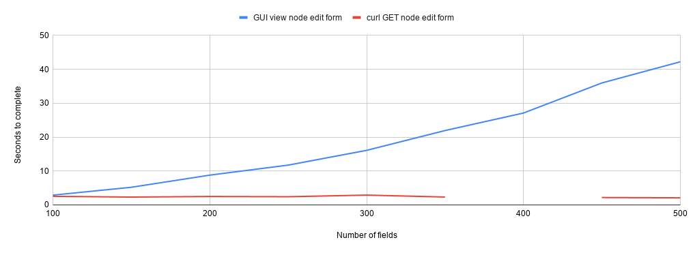

## Goal

By performing the tests described below, I hoped to observe relationsips between the number of fields on a Drupal content type and the time-to-completion of a set of tasks (such as rendering node conent, add/edit forms, REST requests, etc.) on nodes of that content type. My motiviation for doing this was to 1) to document practical limits on the number of fields on a content type, and 2) to provide data that would generate additional areas of investigation leading to workarounds or strategies for managing Islandora content types that have large numbers of metadata fields.

## Test results

### Environment

All tests were done on an [Islandora Playbook](https://github.com/Islandora-Devops/islandora-playbook) virutal machine, using its master branch at commit 47e829a2b222ebcb5c3f6e537c79d107912b40f9 (March 29, 2020, a couple of weekd prior to the release of Islandora 8 1.1.0). This VM used the default Islandora Playbook settings (1 CPU, 4GB of RAM, Ubuntu 16.04, MySQL as the backend database). The host machine was a Thinkpad (i5-8350U CPU @ 1.70GHz × 8 with 16GB of RAM) running Ubuntu 18.04.

### Methodology

To generate the data, I created a Drupal module using the `drupal_field_limit_tester.php` script with a `$num_csv_records` value of 1 (to generate one sample node). I then enabled the module and ran the migration. Using the resulting node, I performed the following tasks:

* Migrate 1 node from CSV
* Viewing (using the Chrome browser) this node as anonymous, with an empty Drupal cache
* Viewing (using the Chrome browser) this node as anonymous with a populated Drupal cache
   * Fetcing this same content using `curl` with both empty and populated Drupal cache
* Viewing (using the Chrome browser) the node add form for my content type, as the "admin" user
* Viewing (using the Chrome browser) the node edit form for my content type (populated with node content), as the "admin" user
   * Fetching this same content using `curl`
* Using `curl` to issue a `GET` request to the sample node's JSON endpoint with an empty Drupal cache, authenticated as the "admin" user
* Using `curl` to issue a `GET` request to the sample node's JSON endpoint with a populated Drupal cache, authenticated as the "admin" user
* Using `curl` to issue a `POST` request to create a node
* Using `curl` to issue a `PATCH` request to update a single field on a node

I chose to migrate only a single node as test data because I wanted to reduce variables that may affect performance to as few as possible. I also speculated that retrieving the same content, using the same caching, in both a graphical web browser and curl would allow me to establish a baseline time that Drupal takes to assemble and deliver HTML markup and content, in order to expose the time it takes to render JavaScript and CSS.

To time the tasks performed using Chrome, I used Chrome's "Performance" tool, available in the hamburger menu > More tools > Developer tools. To time the tasks performed using Chrome, I used the "Total" time produced in the performance tool's "summary" output. To time the tasks performed using curl, I ran the requests with the Linux `time` command, e.g., `time curl http://localhost:8000/node/50` and used the 'real' value from this ouput.

I then rolled back the migration and uninstalled the module. I repeated this for nodes with with 50, 100, 150, 200, 250, 300, 350, 400, 450, and 500 fields.

## Results

### Overall

A chart plotting the number of fields along the X axis (100 to 500 in increments of 50) against the time required to complete the tasks along the Y axis (0 to 50) looks like this:

Below, I will break out some of the specific results. The data the charts are based on is available in [this CSV file](results.csv).

### Rendring the node add and edit forms

The biggest impact of increasing number of fields on a content type is the time it takes for the node add end edit forms to finish rendering:

At around 200 fields, it takes over 5 seconds to render both the blank node add form and a populated node edit form. By 300 fields, that time is over twice as long (over 10 seconds). By 500 fields, it takes over 40 seconds to finish rendering a populated node edit form. Clearly, the user experience for content editors diminshes as the number of fields increases.

The most likely cause of these long rendering times is the JavaScript used by the node add and edit forms. Chrome's performance tool helpfully breaks down the time to render a page into loading, scripting, rendering, painting, system, and idle slices. By far, the largest slice of activity when viewing the node add and edit forms is scripting, followed by rendering. Here is a representative example visualization provided by the tool:

During very long rendering of forms, I observed behavior in the drag and drop UI provided by Drupal to order multiple field values:

Specifically, the drag and drop tools, which use JavaScript under the hood, did not render. Instead, the form showed the native HTML "row widget" weight assignment elements:

Based on this behavior, it seems likely that this JavaScript is contributing heavily to the very long scripting and rendering times shown in the pie chart above. To confirm this, I dug deeper in Chrome's performance tool, which revealed that that the main JavaScript library loaded by the node edit form took approximately 30 seconds to execute of the 43 seconds required to render the edit form.

To test this, I retrieved the popluated node edit form via curl. This version of the form is identical to the version served up to a graphical browser, but does not execute any JavaScript or layout rendering. The time required to simply download the populated node edit form vs. download and render it is shown here:

I explain the gap at 400 fields below in the "Limitations" section.

### Viewing node content

Drupal's page caching for anonymous users is very effective, so it isn't surprising that the number of fields on a node did not increase the amount of time required to render or download the cached node content and markup. The time requiered to retrieve uncached node content and markup did increase with the number of fields on a node, using both Chrome and curl, but the increase was greater in Chrome:

Overall, requesting the JSON representation of an node is faster than fetching a representation containing full HTML markup, which is not surprising.

### REST requests

Number of fields didn't have an appreciable impact on any of the tested REST requests:

Not surprisingly, requesting the JSON representation of an node (via `GET`) is faster than fetching a representation containing full HTML markup, especially requests for cached content, even for authenticated users. I noticed one anomoly (`GET` with no cache, at 400 fields), which I will explain below in the "Limitations" section. At 500 fields, adding nodes (via `POST`) started to take a bit longer than with fewer fields, but updating a single field via `PATCH` was consistently quick all the way up to 500 fields.

## Limitations

This exploration of the practical number of fields you can attach to a Drupal content type provides some baseline data up to 500 fields. However, it has the following limitiations:

* It only tested the time it takes using a graphical web browser to render node add and edit forms. Chrome's developer tools do not provide a way (as far as I can tell) of timing form submit operations.
* All fields attached to nodes for testing purposes are simple text fields (i.e., it doesn't test for performance implications of other field types such as taxonomy fields).
* While it does control for server-side caching (in Drupal at least), it does not account for caching done by Chrome.
* The test data contains a gap at 400 fields. During collection of the data at the 400 field point, Drupal (or Chrome) hung while retrieving the populated node edit form. I decided to leave this gap instead of restart the entire 400-field test run in order to be consistent with the other data collection runs. However, it is unlikely the lack of one data point invalidates the trends revealed by the rest of the data.

## Conclusions

Based on the data presented here, the largest impact of large numbers of fields attached to a node is the user experience for content editors: the more fields, the longer it takes to render (and therefore use) node add and edit forms. There may be ways to mitigate this, for example by breaking up add/edit forms into multiple smaller forms using something like the [Forms Steps](https://www.drupal.org/project/forms_steps) contrib module.

Lage numbers of fields did not have a substantial impact on the time required to view a node (at least cached versions of nodes), or on REST operations, including create (`POST`) and update (`PATCH`) requests. The efficiency of REST requests suggests that decoupled Drupal clients may be able to replace the HTML add/edit forms in some applications, provided the user experience of those clients doesn't also suffer when dealing with nodes that contain very large numbers of fields.

