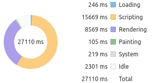
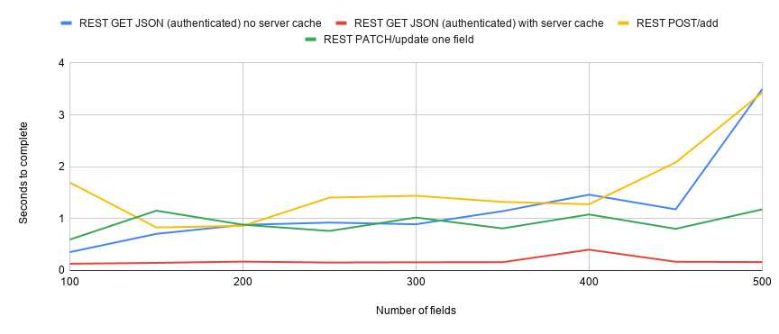

## Goal

By performing the tests described below, I hoped to observe relationsips between the number of fields on a Drupal content type and the time-to-completion for a set of tasks (such as rendering node conent, add/edit forms, REST requests, etc.) on nodes of that content type. My motiviation for doing this was to 1) to document practical limits on the number of fields on a content type, and 2) to provide data that would generate additional areas of investigation leading to workarounds or strategies for managing Islandora content types that have large numbers of metadata fields.

## Methodology

### Environment

All tests were done on an [Islandora Playbook](https://github.com/Islandora-Devops/islandora-playbook) virutal machine, using its master branch at commit 47e829a2b222ebcb5c3f6e537c79d107912b40f9 (March 29, 2020, a couple of weekd prior to the release of Islandora 8 1.1.0). This VM used the default Islandora Playbook settings (1 CPU, 4GB of RAM, Ubuntu 16.04, MySQL as the backend database). The host machine was a Thinkpad (i5-8350U CPU @ 1.70GHz × 8 with 16GB of RAM) running Ubuntu 18.04.

### Data collection

To generate the data, I created a Drupal module using the `drupal_field_limit_tester.php` script with a `$num_csv_records` value of 1 (to generate one sample node). After enabling the module, I performed the following tasks:

* Migrated 1 node from CSV
* Viewed (using the Chrome browser) this node as anonymous, with an empty Drupal cache
* Viewed (using the Chrome browser) this node as anonymous with a populated Drupal cache
   * Fetched this same content using `curl` with both empty and populated Drupal cache
* Viewed (using the Chrome browser) the node add form for my content type, as the "admin" user
* Viewed (using the Chrome browser) the node edit form for my content type (populated with node content), as the "admin" user
   * Fetched this same content using `curl`
* Using `curl`, issued a `GET` request to the sample node's JSON endpoint with an empty Drupal cache, authenticated as the "admin" user
* Using `curl`, issued a `GET` request to the sample node's JSON endpoint with a populated Drupal cache, authenticated as the "admin" user
* Using `curl`, issued a `POST` request to create a node
* Using `curl`, issued a `PATCH` request to update a single field on a node

I created only a single node as test data in order to reduce variables that may affect performance. I speculated that retrieving the same content, using the same caching, in both a graphical web browser and curl would allow me to establish a baseline time-to-completion that Drupal requires to assemble and deliver HTML markup and content, in order to compare that baseline with the time it takes a graphical web browser to render JavaScript and CSS.

To time the tasks performed using a graphical browser, I used Chrome's "Performance" tool, available in the hamburger menu > More tools > Developer tools. To time the tasks performed using Chrome, recording the "Total" time produced in the performance tool's "Summary" output. To time the tasks performed using curl, I ran the requests with the Linux `time` command, e.g., `time curl http://localhost:8000/node/50` and used the "real" value from this ouput.

I then rolled back the migration and uninstalled the module, repeating the entire set of tasks for nodes with with 50, 100, 150, 200, 250, 300, 350, 400, 450, and 500 fields.

## Results

### Overall

A chart plotting the number of fields along the X axis (100 to 500 in increments of 50) against the time required to complete the tasks along the Y axis (0 to 50 seconds) looks like this:

Below, I will break out some of the specific results. The data the charts are based on is available in [this CSV file](results.csv).

### Rendering the node add and edit forms

The biggest impact of the increasing number of fields on a content type is the time it takes for the node add and edit forms to finish rendering:

At around 200 fields, it takes over 5 seconds to render both the blank node add form and a populated node edit form. By 300 fields, that time is over twice as long (over 10 seconds). By 500 fields, it takes over 40 seconds to finish rendering a populated node edit form. Clearly, the user experience for content editors diminshes as the number of fields increases.

The most likely cause of these long rendering times is the JavaScript used by the node add and edit forms. Chrome's performance tool helpfully breaks down the time to render a page into loading, scripting, rendering, painting, system, and idle slices. By far, the largest slice of activity when viewing the node add and edit forms is scripting, followed by rendering. Here is a representative visualization provided by the tool:

During very long rendering of forms, I observed behavior in the drag and drop UI provided by Drupal to order multiple field values:

Specifically, the drag and drop UI elements, which use JavaScript under the hood, did not render. Instead, Drupal reverted to the native HTML "row widget" weight assignment elements:

Based on this behavior, it seemed likely that this JavaScript contributed heavily to the very long scripting and rendering times shown in the pie chart above. To confirm this, I dug deeper in Chrome's performance tool, which revealed that that the main JavaScript library loaded by the node edit form took approximately 30 seconds to execute of the 43 seconds required to render the edit form.

To gather additional data to narrow down the impact of executing JavaScript when rendering the node edit form, I retrieved the popluated node edit form via curl, authenticated as the Drupal "admin" user. The HTML markup and node field content in this version of the form is identical to the that deliverd to a graphical browser. Since curl does not execute any JavaScript or layout rendering, it makes sense that the time required for curl to complete its request for the populated node edit form is much lower than the same request by a graphical browser:

Despite a gap in data at 400 fields (which I explain below in the "Limitations" section), it appears that the number of fields has little effect on how long Drupal requires to assemble and serve up the populated edit form, and that preparing the form for use within a graphical web browser takes a long time.

### Viewing node content

Drupal's page caching for anonymous users is very effective, so it isn't surprising that the number of fields on a node did not increase the amount of time required to render or download the cached node content and markup. The time requiered to retrieve uncached node content and markup did increase with the number of fields on a node, using both Chrome and curl, but the increase was greater in Chrome than using curl, which is to be expected since it needs to render the additional fields. This chart includes data on requesting the full HTML representation of an node via curl, to provide a control for rendering the node data in a graphical browser:

Based on this data, we see that requests for uncached nodes takes substantially longer than requests for cached nodes, for both graphical and non-graphical clients. I expected Chrome to take longer to render cached node content (the red line in the chart) as the number of fields increased, but the data shows that is not the case.

### REST requests

Number of fields didn't have an appreciable impact on any of the tested REST requests:

Requesting the JSON representation of an node (via `GET`) is fairly fast regardless of the number of fields, especially requests for cached content, and even for authenticated users. There is one anomaly (`GET` with no cache, at 400 fields), which I will explain below in the "Limitations" section. It isn't surprising that requesting the JSON via a REST request is faster than fetching a fully rendered version of the node, since the JSON representation contains no HTML markup.

At 500 fields, adding nodes (via `POST`) started to take a bit longer than with fewer fields, but updating a single field via `PATCH` was consistently quick all the way up to 500 fields.

## Limitations

This exploration of the practical number of fields you can attach to a Drupal content type provides some baseline data up to 500 fields. However, it has the following limitiations:

* It only tested the time it takes using a graphical web browser to *render* node add and edit forms. Chrome's developer tools do not provide a way (as far as I can tell) of timing form submit operations.
* All fields attached to nodes for testing purposes are simple text fields (i.e., this study doesn't test for performance implications of other field types such as taxonomy fields).
* While this study does control for server-side caching (in Drupal at least), it does not account for caching done by Chrome.
* The test data contains a gap, and an anomaly, at 400 fields. During collection of the data at the 400 field point, Drupal (or Chrome) hung while retrieving the populated node edit form. I decided to leave this gap in the data instead of restart the entire 400-field test run in order to be consistent with the other data collection runs. However, it is unlikely the lack of one data point invalidates the trends revealed by the rest of the data. Likewise, at 400 fields, we see an out-of-trend spike in the time required to complete the the `GET` REST request. I assume that these two exceptions were caused by same underlying problem with Drupal.

## Conclusions

Based on the data presented here, the largest impact of large numbers of fields attached to a node is the user experience for content editors: the more fields, the longer it takes to render (and therefore use) node add and edit forms. There may be ways to mitigate this, for example by breaking up add/edit forms into multiple smaller forms using something like the [Forms Steps](https://www.drupal.org/project/forms_steps) contrib module.

Lage numbers of fields did not have a substantial impact on the time required to view a node (at least cached versions of nodes), or on REST operations, including create (`POST`) and update (`PATCH`) requests. The efficiency of REST requests suggests that decoupled Drupal clients may be able to replace the HTML add/edit forms in some applications, provided the user experience of those clients doesn't also suffer when dealing with nodes that contain very large numbers of fields.

